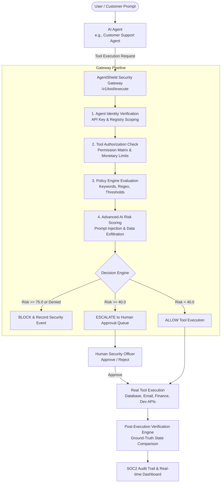

# 🛡️ AgentShield — Enterprise AI Agent Security & Policy Gateway

**AgentShield** is an enterprise-grade AI Agent Security Gateway and Control Plane designed to authenticate, authorize, monitor, and verify AI agent tool executions in real-time.

---

## 📐 Architecture Overview



---

## 🚀 Quick Start Guide

### 1. Prerequisites
- Python 3.10+
- Node.js 18+ (for dashboard UI)
- PostgreSQL or SQLite

---

### 2. Backend Setup & Startup

```bash
cd backend
python -m venv venv
# On Windows PowerShell:
.\venv\Scripts\Activate.ps1
# On macOS/Linux:
source venv/bin/activate

pip install -r requirements.txt

# Run automatic database seeding (Creates Acme Corp, Agents, Tools, Policies & Approvals)
python seed_data.py

# Start FastAPI server on http://localhost:8000
python main.py
```

FastAPI Interactive API Documentation:
- Swagger Docs: `http://localhost:8000/docs`
- Gateway Endpoint: `http://localhost:8000/v1/tool/execute`

---

### 3. Frontend Dashboard Setup & Startup

```bash
cd frontend

# Install Node dependencies
npm install

# Start Vite React Dashboard on http://localhost:3000
npm run dev
```

---

### 4. Docker Deployment Setup

```bash
# Spin up PostgreSQL, FastAPI Backend, and Nginx React Frontend with one command:
docker-compose up --build
```

---

## 📦 Official SDK Usage Examples (Phase 9)

### Python SDK (`sdks/python`)

```python
from agentshield_sdk import AgentShieldClient

shield = AgentShieldClient(
    api_key="sk_agent_support_001_xxxx",
    endpoint="http://localhost:8000"
)

# Execute tool through AgentShield Security Gateway
response = shield.execute(
    tool="send_email",
    input={
        "to": "customer@acme.com",
        "subject": "Ticket Resolved",
        "body": "Your support ticket #8891 has been marked resolved."
    }
)

print("Gateway Decision:", response["decision"])
print("Risk Score:", response["risk_score"])
print("Result:", response["result"])
```

### JavaScript / TypeScript SDK (`sdks/javascript`)

```javascript
const { AgentShieldClient } = require('@agentshield/sdk');

const shield = new AgentShieldClient({
  apiKey: 'sk_agent_support_001_xxxx',
  endpoint: 'http://localhost:8000'
});

async function run() {
  const result = await shield.execute({
    tool: 'refund_customer',
    input: {
      customer_id: 'CUST_9921',
      amount: 2500
    }
  });

  console.log('Decision:', result.decision);
}

run();
```

---

## 🌟 Key Features & Phase Breakdown

1. **Phase 1 — Real AI Agent Support**: Included `CustomerSupportAgent` simulator and tool calling sandbox.
2. **Phase 2 — Agent Identity**: Agent Registry with environment isolation and API key hashing (`sk_live_...`).
3. **Phase 3 — Tool Authorization Matrix**: Granular Read/Write permissions and maximum monetary thresholds.
4. **Phase 4 — Security Gateway**: `/v1/tool/execute` multi-tier pipeline evaluating identity, permissions, policies, risk, execution, and verification.
5. **Phase 5 — Human Approval Queue**: Human-in-the-Loop approval workflows for escalated high-risk actions.
6. **Phase 6 — Production DB**: Multi-tenant database schema supporting Organizations, Users, Agents, Tools, Policies, Executions, Approvals, and Audit Logs.
7. **Phase 11 — Advanced AI Security Engine**: Real-time detection of Prompt Injection attacks, Data Exfiltration attempts (PII/Credit Cards/SSNs), and SQL mutation attacks.
8. **Phase 12 — Verification Engine**: Independent ground-truth state verification to validate agent claims vs system reality.
9. **Phase 13 — Enterprise Security Dashboard**: Interactive React + Tailwind dashboard with live streams, policy editor, permission matrix, and threat monitor.
